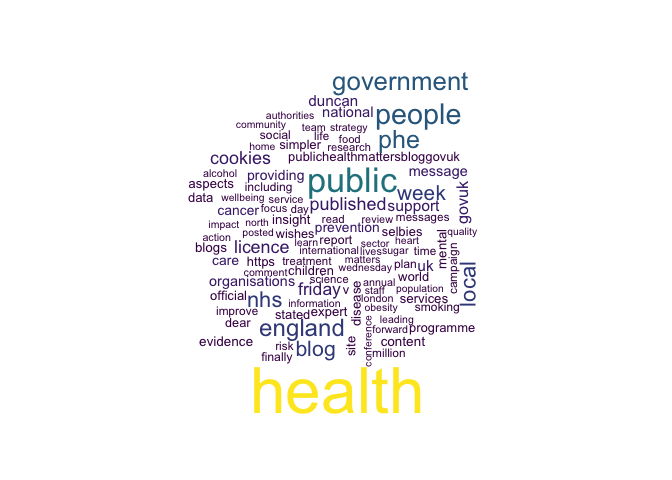
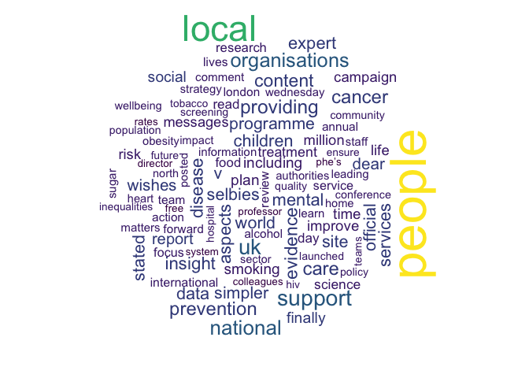
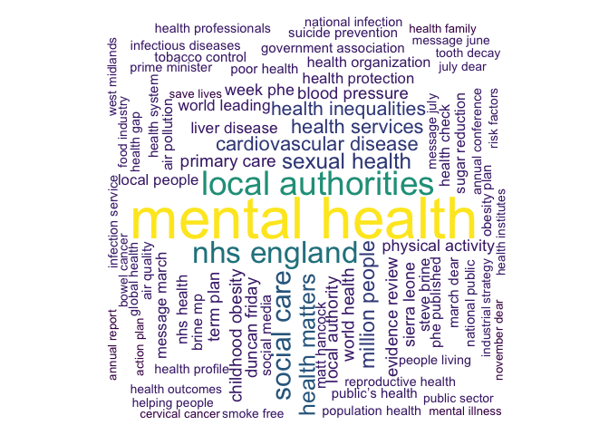
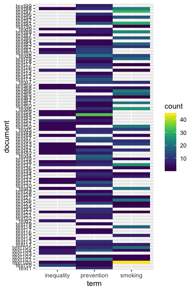

Analysing text in public health practice using R
================

# Motivation

It is said that \> 90% of the world’s data is *unstructured* - that is
data not following a fixed schema or format. Text is said to be
unstructured data and there is growing recognition that analysing text
can generate new insight and new hypotheses, and automate repetitive
tasks.

R has a powerful suite of text analytical tools.

In this note we demonstrate some applications of text mining to support
the core public health activities of reading and writing.

## Some basics - turning text into data

First some basic terminology:

  - token  
    a basic unit of textual data, for example characters, words, ngrams,
    sentences
  - stop words  
    common words e.g. *the, and, it* which are generally removed from
    texts prior to analysis
  - ngram  
    one or more successive words. One word is a *unigram*, two
    consecutive words a *bigram* and so on.
  - corpus  
    a data format for storing documents or texts
  - document-term-matrix  
    a matrix in which the rows are documents are texts or documents, the
    columns are tokens and the cell values are counts
  - stemming  
    stemming is the process of reducing inflected (or sometimes derived)
    words to their word stem, base or root form
  - lemma  
    Lemmatisation (or lemmatization) in linguistics is the process of
    grouping together the inflected forms of a word so they can be
    analysed as a single item, identified by the word’s lemma, or
    dictionary form.

### R packages

There are a number of really useful R packages for text analysis. The
ones I use (and have used in this note) are:

  - `tm` full text mining
  - `tidytext` tidy text mining
  - `quanteda` powerful and quick
  - `sentimentr` sophisticated sentiment
  - `readtext` powerful text reader
  - `udpipe` nlp

I have also developed some useful (I think) functions which I house in
the `myScrapers` package.

``` r
library(pacman)

p_load(tm, tidytext, quanteda, sentimentr, readtext, udpipe, tidyverse, textrank,  wordcloud)

remotes::install_github("julianflowers/myScrapers", force = TRUE)

library(myScrapers)
```

### Getting text

We’ll need some text to work with. For this we will scrape the text of
Duncan Selbie’s friday messages from PHE blogs via \[1\].

``` r
## create a list of weblinks
url <- "https://publichealthmatters.blog.gov.uk"
url1 <- paste0(url, "/page/", 2:93)
urls <- c(url, url1)


## extract page links from blog pages
links <- map(urls, get_page_links)

## filter to extract links for Friday blogs

link_text <- links %>%
  enframe() %>%
  unnest() %>%
  mutate(friday_message = str_detect(value, "duncan-selbies-friday-message")) %>%
  filter(friday_message == TRUE, 
         !str_detect(value, "#comment")) %>%
  distinct() %>%
  mutate(date = str_extract_all(value, "\\d{4}/\\d{2}/\\d{2}")) %>%
  unnest(date) %>%
  mutate(text = map(value, get_page_text))

## extract page text

texts <- link_text %>%
  group_by(date) %>%
  mutate(text = paste(text, collapse = " ")) %>%
  select(date, text)


head(texts)
```

    ## # A tibble: 6 x 2
    ## # Groups:   date [6]
    ##   date       text                                                          
    ##   <chr>      <chr>                                                         
    ## 1 2019/07/26 "c(\"\\n    GOV.UK blogs use cookies to make the site simpler…
    ## 2 2019/07/19 "c(\"\\n    GOV.UK blogs use cookies to make the site simpler…
    ## 3 2019/07/08 "c(\"\\n    GOV.UK blogs use cookies to make the site simpler…
    ## 4 2019/06/21 "c(\"\\n    GOV.UK blogs use cookies to make the site simpler…
    ## 5 2019/06/07 "c(\"\\n    GOV.UK blogs use cookies to make the site simpler…
    ## 6 2019/05/31 "c(\"\\n    GOV.UK blogs use cookies to make the site simpler…

### Tokenisation

``` r
tokens <- texts %>%
  unnest_tokens(word, text, "words") %>%
  anti_join(stop_words) %>%
  mutate(word = tm::removeNumbers(word), 
         word = tm::removePunctuation(word)) 

head(tokens, 30)
```

    ## # A tibble: 30 x 2
    ## # Groups:   date [1]
    ##    date       word                        
    ##    <chr>      <chr>                       
    ##  1 2019/07/26 govuk                       
    ##  2 2019/07/26 blogs                       
    ##  3 2019/07/26 cookies                     
    ##  4 2019/07/26 site                        
    ##  5 2019/07/26 simpler                     
    ##  6 2019/07/26 cookies                     
    ##  7 2019/07/26 https                       
    ##  8 2019/07/26 publichealthmattersbloggovuk
    ##  9 2019/07/26 ""                          
    ## 10 2019/07/26 ""                          
    ## # … with 20 more rows

## Visualising the blogs

### Wordclouds

It is a straightforward task to create a simple visualisation of the
blogs with a wordcloud

``` r
palette = viridis::viridis(10)

tokens_count <- tokens %>%
  ungroup() %>%
  count(word) %>%
  filter(nchar(word) > 0) 


with(tokens_count, wordcloud(word, n, max.words = 100, colors = palette))
```

<!-- -->

We can see some words which feature in every blog - for example -
\*cookies, blog, duncan, publichealthmattersbloggovuk, week" which tend
to dominate the wordcloud. We’ll remove some of the these frequent
terms…

``` r
tokens_count1 <- tokens %>%
  ungroup() %>%
  count(word) %>%
  filter(nchar(word) > 0, 
         !word %in% c("cookies", "blog", "duncan", "licence", "phe", "govuk", "government", "publichealthmattersbloggovuk", "week", "blogs", "health", 
                      "public", "published", "friday", "https", "message", "nhs")
         ) 

with(tokens_count1, wordcloud(word, n, max.words = 100, colors = palette))
```

<!-- -->

We can see words like local, prevention, mental, cancer, disease,
evidence, expert and insight are frequently mentioned.

### Bigram clouds

Sometimes bigram (2-word) wordclouds are more informative.

``` r
bigram_count <- texts %>%
  mutate(text = tm::removeNumbers(text)) %>%
  ungroup() %>%
  create_bigrams(., "text") %>%
  count(bigram, sort = TRUE) %>%
  top_n(100, n) %>%
  filter(n< 100, 
         !bigram %in% c("friday messages", "wishes duncan", "wishes friday"))
set.seed(123)
with(bigram_count, wordcloud(bigram, n, max.words = 100, colors = palette, rot.per  =.5, random.order = FALSE))
```

<!-- -->

We can now see that “mental health” and “local authorities” feature
heavily.

## Creating a corpus

Converting texts to a corpus format is required for some text mining
operations. This is easily done with the `quanteda` package. Docvars are
metadata fields which can be added to the corpus.

``` r
corpus <- corpus(texts, text_field = "text")

corpus[1]
```

    ##                                                                                                                                                                                                                                                                                                                                                                                                                                                                                                                                                                                                                                                                                                                                                                                                                                                                                                                                                                                                                                                                                                                                                                                                                                                                                                                                                                                                                                                                                                                                                                                                                                                                                                                                                                                                                                                                                                                                                                                                                                                                                                                                                                                                                                                                                                                                                                                                                                                                                                                                                                                                                                                                                                                                                                                                                                                                                                                                                                                                                                                                                                                                                                                                                                                                                                                                                                                                                                                                                                                                                                                                                                                                                                                                                                                                                                                                                                                                                                                                                                                                                                 text1 
    ## "c(\"\\n    GOV.UK blogs use cookies to make the site simpler. Find out more about cookies\\n  \", \"https://publichealthmatters.blog.gov.uk/2019/07/26/duncan-selbies-friday-message-26-july-2019/\", \"\", \"Dear everyone\", \"Firstly, congratulations to the Right Honourable Matt Hancock MP who has been reappointed as Secretary of State for Health and Social Care.\", \"This week saw the publication of the Prevention Green Paper, offering everyone the next opportunity to shift the focus from cure to prevention. A Green Paper is by definition the beginning of a conversation and is timely with the formation of a new Government. We look forward to working with everyone on the consultation over the next three months and in readiness for the Spending Review.\", \n\"PHE has been working on Predictive Prevention which aims to give people tailored information at the times they want it and are likely to use it drawing on behavioural science and the latest information technology and digital platforms. The programme poses and looks to answer some important questions, including whether and how a more intelligent, personal approach to information sharing can be used to improve health and wellbeing.  Our latest blog explains this further.\", \"\", \"The Department of Health and Social Care announced this week that all NHS pharmacies will be expected to become Healthy Living Pharmacies (HLPs) by April 2020, which follows the introduction by PHE in 2016 of a profession-led process for how pharmacies can attain HLP status and the NHSE/I led quality payment for HLP status.There are already over 9,500 such pharmacies in England helping people stay well and manage when unwell.  This announcement is included in the new community pharmacy contractual framework and will mean many more pharmacists and their teams will be providing interventions that promote good health.\", \n\"The Systemic Anti-Cancer Therapy (SACT) database is a world-first collection of data on chemotherapy treatments, recording all those given to all cancer patients across England. We have published a paper in the International Journal of Epidemiology, which provides an insight into the SACT dataset and highlights how it can be used to improve patient care and the most effective treatments.\", \"This Sunday marks World Hepatitis Awareness Day and PHE is working with the NHS and local government to trace and treat people who were diagnosed before curative treatments were widely available, as well as encouraging targeted testing in the general population. As this infection, which causes liver cirrhosis and cancer, is often symptom-free for many years some people may not be aware they are infected and it more often affects marginalised groups.\", \n\"The Kingdom of Saudi Arabia is expecting to welcome 3.7 million Muslims from around the globe for Hajj this August. We have renewed our public health advice calling for pilgrims, travellers and health care professions to be aware of the signs and symptoms of Middle East Respiratory Syndrome Coronavirus (MERS-CoV infection) which is currently circulating in the region. Though the risk of infection for UK residents travelling to the Middle East remains very low, we have further updated our MERS-CoV infection risk assessment ahead of Hajj.\", \n\"The latest edition of Health Matters focuses on taking a whole systems approach to tackling obesity. Alongside the content, there is a blog post and free, downloadable infographics that can be used to share the key messages.\", \"Best wishes, Duncan\", \"You can subscribe to the Friday message newsletter version which goes direct to your inbox here.\", \" \", \"The official blog of Public Health England, providing expert insight on the organisation's work and all aspects of public health. More about this blog.\", \n\"Open Government Licence\", \"All content is available under the Open Government Licence v3.0, except where otherwise stated\")"

## Creating a document feature matrix (dfm)

The main analytical format for text mining is a document-term or
document-feature matrix (dfm). This is easy to create in `quanteda`.
dfms are *sparse* matrices - that is most of the cells are 0. They can
be very large so can have high computing overhead. We can remove
numbers, stopwords, urls etc. and create
ngrams.

``` r
dfm <- dfm(corpus, remove = stopwords("en"), remove_numbers = TRUE, remove_punct =  TRUE, remove_url = TRUE, ngrams = 1:3)

dfm
```

    ## Document-feature matrix of: 105 documents, 98,993 features (98.3% sparse).

## Dictionary searching

We can search within dfms using specified terms. These can be setup as a
dictionary. The `create_lookup` function in `myScrapers` facilitates
this.

``` r
terms <- create_lookup(prevention = c("prevent*", "avoid*"), 
                       smoking = c("smok*", "tobacco"), 
                       inequality = c("ineq*"))

terms
```

    ## Dictionary object with 3 key entries.
    ## - [prevention]:
    ##   - prevent*, avoid*
    ## - [smoking]:
    ##   - smok*, tobacco
    ## - [inequality]:
    ##   - ineq*

``` r
result <- dfm_lookup(dfm, dictionary = terms)

tidy(result) %>%
  #spread(term, count, fill = 0) %>%
  ggplot(aes(term, document, fill = count)) +
  geom_tile() +
  viridis::scale_fill_viridis() 
```

<!-- -->

## Keywords in context (kwic)

kwic allows us to find the surrounding words for any given terms. For
example if we want to find the context for “inequality” we can apply the
kwic function.

``` r
ineq <- kwic(corpus, "inequal*", window = 10)

ineq <- data.frame(ineq) 

ineq %>%
  head()
```

    ##   docname from  to
    ## 1   text2  619 619
    ## 2   text2  674 674
    ## 3   text3  908 908
    ## 4   text5  920 920
    ## 5   text9  368 368
    ## 6  text10  228 228
    ##                                                           pre      keyword
    ## 1 align talent and resource across the North to reduce health inequalities
    ## 2     this gap is improving productivity . The North has more inequalities
    ## 3  a powerful presentation which was a reminder of the health inequalities
    ## 4        , Local Health provides an insight into the scale of inequalities
    ## 5  to produce this and it emphasises action to address health inequalities
    ## 6                   the root causes of obesity . " , " Health inequalities
    ##                                                                      post
    ## 1                                . " , " The health gap between the North
    ## 2 within health services and receives less research funding compared with
    ## 3             which continue for them and the potential for changing that
    ## 4                        within local areas and you can learn more in our
    ## 5                  and the wider determinants of health , areas AHPs have
    ## 6                    in England are not improving and the need to address
    ##    pattern
    ## 1 inequal*
    ## 2 inequal*
    ## 3 inequal*
    ## 4 inequal*
    ## 5 inequal*
    ## 6 inequal*

There are 47 mentions of the word “inequality” in 35 blogs.

1.  they are now only available via html embedded emails
